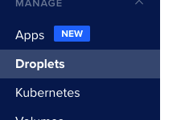
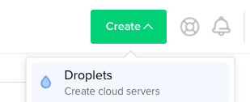
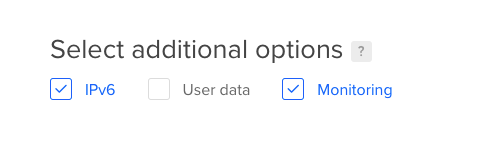
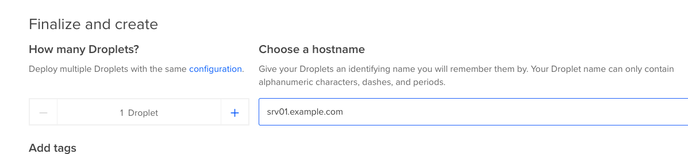
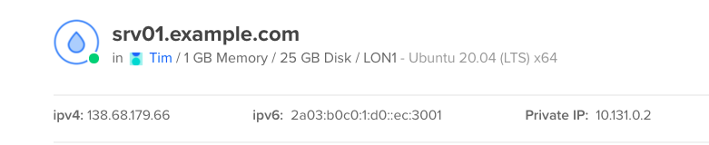
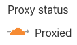
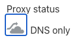

# Stage 0: Manual stage
## Intro
This stage will cover simply setting up a simple server and deploying your code.

### Pros
* Simple
* Get to learn what for future stages
* Up and running quickly

### Cons
* Not repeatable
* Hard not to have a difference between prod and dev
* Missing recommended extra programs, e.g. Postfix, Centralised logging
* Single point of failure (Only one server)
* No documentation on how exactly to set future servers up

## Assumptions
1. Php code is in git.
1. You are using PostgreSQL.
1. If not, replace the PostgreSQL step with your DB of choice.
1. You have a server.
1. In this example and future ones, we'll be deploying to [DigitalOcean](https://m.do.co/c/179a47e69ec8)
   but the steps should mostly work with any servers.
1. The server is running Ubuntu 20.04
1. You have SSH key pair.
1. Needed to log into your server securely.
1. You have a Domain Name, and you can add entries to point to the server.
1. We'll be using example.com here. Just replace that with your domain of choice.
1. For DNS, I'll be using [Cloudflare](https://www.cloudflare.com/) in these examples.
1. I would recommend using a DNS provider that supports [Terraform](https://www.terraform.io/) and
   [LetsEncrypt](https://community.letsencrypt.org/t/dns-providers-who-easily-integrate-with-lets-encrypt-dns-validation/86438)


## Step 1: Get the information needed
Decide on the domain that you would like to use for your server. e.g. www.example.com.

Decide on a name for your server. You'll use this as a DNS entry to point to the server.

The server name is more important for later steps where you'll have more than one server.

Naming servers can follow any naming system you want.

For this example, we are going to be boring and use
the simple ```srv01```will then have a domain name of ```srv01.example.com```.

## Step 2: Create a virtual server
Log into your [DigitalOcean](https://m.do.co/c/179a47e69ec8) and select the droplets tab.



Then click the create button and select Droplets - Create cloud servers.



You should now see the virtual server creation page.

For the example, we are just going to create the smallest server possible, though you may need to select
a larger one if you need more performance.

We'll be using Ubuntu 20.04 mainly as it's the long term release version.

Please pick the distribution you know.

Pick the region that is closest to your clients or meets your requirements the best.

To follow [POPIA](https://popia.co.za), I'm using a region that also follows
[GDPR](https://gdpr-info.eu/).

So I've picked Frankfurt.

Under additional options, select IPv6 and Monitoring.



Under authentication, select or add your SSH key.

Now add the hostname with the domain that you chose above as the server hostname. e.g. ```srv01.example.com```



DigitalOcean will create PTR records pointing back to the servers IP's. Some service use this to
validate your server, so it's a good idea to get it correct.

Now click the create button to finalise.


DigitalOcean will start creating your virtual server and take you to a page showing the creation progress.

Wait for the server to finish being created, then continue with the next step.

## Step 3: Setup DNS
After your server has finished creating, open up the new server page.

You should have both an IPv4 and IPv6 address for the server at the top of the page.

If you don't have the IPv6 IP, you can click the 'Enable now button'.



Grab these two IP's and head over to your DNS provider.

I'll be going over how to do this with [Cloudflare](https://www.cloudflare.com/), but the steps should be the same for most other
providers.

Now using the IP's create both A records, using the IPv4, and AAAA records, using the IPv6, for the following
entries.

If you are using [Cloudflare](https://www.cloudflare.com/), make sure the proxy is disabled for now.

Click on the orange cloud when adding the entry to make it grey.





* root domain
  *, e.g. ```example.com```
* ```www.example.com```
* server name that you picked previously
  *, e.g. ```srv01.example.com```

These will allow your users to get to your site on the two most common names.

Later, once you have more than one server, it is easier to connect to the specific server.

Once you have done this, you can test that everything is working by doing a lookup of the domain name.

```dig example.com```

Also, confirm that the PTR record exists. (This should match the server name you set)

```dig -x <IP>```

## Step 4: Setup the server

Ok, first ssh to the server as the root user.

```ssh root@example.com```

As you have used a key, there should be no password required.

**For any commands you use going forward. Please copy them into a separate file, so you have a history.**

You'll use this file at a later stage when we start automating the server setup.

It's also good to have a record of exactly your server is set up.

An example can be found at this link:

[setupCommands.sh](./setupCommands.sh)

### Step 4.1: First update the server

The following will make sure the server is fully updated and rebooted.

As we haven't edited any configs, you can select Y for all the 'Configuration file modified'.

After you have altered some configuration files, you will need to be more careful.

You will want to re-run this on the server every x days to make sure it's entirely up to date.

There is a minimal risk that this can break the server.

We'll be covering a better way to mitigate this risk at a later stage.

The simplest way is to have two servers and to update them in alternating weeks.

```bash
apt update
apt -y \
  dist-upgrade \
  -o Dpkg::Options::=--force-confdef \
  -o Dpkg::Options::=--force-confnew
apt -y autoremove
reboot
```

### Step 4.2: Install the basics to run Laravel

I've separated the command to make them more readable and explain what each is doing.

Though you can run them as once command

#### Install the database

Make sure we will get the latest PostgreSQL
```bash
echo "deb https://apt.postgresql.org/pub/repos/apt/ $(lsb_release -cs)-pgdg main" > /etc/apt/sources.list.d/pgdg.list
apt-key adv --keyserver keyserver.ubuntu.com --recv-keys 7FCC7D46ACCC4CF8
apt update
```

Install PostgreSQL
```bash
apt install -y postgresql postgresql-client postgresql-contrib
```

#### Install Redis
Make sure we will get the latest Redis
```bash
add-apt-repository -y ppa:chris-lea/redis-server
apt update
```

Install Redis
```bash
apt install -y redis
```

#### Install the PHP and required PHP modules
Make sure we will get the latest PHP
```bash
add-apt-repository -y ppa:ondrej/php
apt update
```

Install PHP and modules
```bash
apt install -y php7.4 php7.4-cli php7.4-fpm \
      php7.4-bcmath \
      php7.4-common php7.4-curl \
      php7.4-dev \
      php7.4-gd php7.4-gmp php7.4-grpc \
      php7.4-igbinary php7.4-imagick php7.4-intl \
      php7.4-mcrypt php7.4-mbstring php7.4-mysql \
      php7.4-opcache \
      php7.4-pcov php7.4-pgsql php7.4-protobuf \
      php7.4-redis \
      php7.4-soap php7.4-sqlite3 php7.4-ssh2  \
      php7.4-xml \
      php7.4-zip
```

#### Install NGINX webserver

Make sure we will get the latest NGINX
```bash
add-apt-repository -y ppa:nginx/stable
apt update
```

Install Nginx webserver
```bash
apt install -y nginx
```

#### Install certbot for ssl certificate

Install certbot
```bash
apt install -y \
  certbot \
  python3-certbot-nginx
```

With all the PPA's added, just run a dist-upgrade to make sure everything is updated.
```bash
apt -y dist-upgrade
apt -y autoremove
```

### Step 4.3: Configure Nginx to use PHP

Now edit the file ```/etc/nginx/sites-enabled/default```

Replace everything with:

```nginx
server {
  listen 80 default_server;
  listen [::]:80 default_server;

  root /var/www/site/public;

  index index.html index.htm index.php;

  server_name _;

  location / {
    try_files $uri $uri/ =404;
  }

  location ~ \.php$ {
    include snippets/fastcgi-php.conf;
    fastcgi_pass unix:/run/php/fpm.sock;
  }

  location ~ /\.ht {
    deny all;
  }
}
```

To make life easier, you can just run the following command.

```bash
cat > /etc/nginx/sites-enabled/default <<- EOM
server {
  listen 80 default_server;
  listen [::]:80 default_server;

  root /var/www/site/public;

  index index.html index.htm index.php;

  server_name _;

  location / {
    try_files \$uri \$uri/ /index.php?q=\$uri&\$args;
  }

    location ~ \.php$ {
        include snippets/fastcgi-php.conf;
        fastcgi_pass unix:/run/php/php-fpm.sock;
     }

  location ~ /\.ht {
    deny all;
  }
}
EOM
```

Create the ```/var/www/site/public``` directory.

Create a ```/var/www/site/public/index.html``` with some text in it.

Then make the directory and files owned by the NGINX servers user (www-data).

```bash
mkdir -p  /var/www/site/public
echo "hello world" > /var/www/site/public/index.html
chown -R www-data: /var/www/site/public
```

Then restart Nginx ```service restart nginx```.

### Step 4.4: Generating the SSL certificate

As we have already installed certbot and have the DNS pointing at the server, it is pretty simple
to get the certificate generated and set up.

First, confirm the Nginx is up by typing your domain into the browser with HTTP. (HTTPS won't
work yet)

e.g. Go to http://www.example.com

You should get the text you added to the index.html file.

```nginx
index index.html index.htm index.php;
```

Ok, we are now going to use certbot to generate our certificates and enable SSL.

You'll need to provide it with an email address that it can notify you of expiring certs and the ```www```
domain.

e.g. ```www.example.com```

You also want to enable the redirect.

```bash
certbot --nginx -d www.example.com -d example.com
```

Once you are complete, you can then restart your Nginx server to apply the changes.

```bash
service nginx restart
```

You can now reload the web page. It should redirect you to HTTPS, and you should get
a lock in the browser.

If you now edit the ```/etc/nginx/sites-enabled/default``` file, you'll see that the file has the certificate information.

We are pretty close to being finished.

### Step 4.5: Setup database credentials

Decide on the user, password and database name you would like.

For this, we'll be using db_example,user_example and password_example for all three but please pick a more secure password.

Then run the following replacing example with what you have picked.

```bash
sudo -s -u postgres createuser user_example
sudo -s -u postgres createdb db_example
echo "alter user user_example with encrypted password 'password_example';" | sudo -u postgres psql
echo "grant all privileges on database db_example to user_example;" | sudo -u postgres psql
```

### Step 4.6: Deploying your application - Final Step

Now for the final steps.

We need to install Composer and then clone the app and do the final setup.

To start, let's install Composer.

```bash
php -r "copy('https://getcomposer.org/installer', 'composer-setup.php');"
php composer-setup.php --install-dir=/bin --filename=composer
php -r "unlink('composer-setup.php');"
```

We can confirm it's working and available to the www-data user.

The www-data user is the user that Nginx is running as.

You never want to run Composer as root if you can.

```bash
sudo -s -u www-data composer
```

Next, we want to git clone our application to the HTML directory.

Before we do that, we need to generate an ssh key pair for the server. GitHub requires the key as a deployment key.

To generate a key run the following:

```bash
ssh-keygen -t ed25519 -a 100 -f ~/.ssh/id_ed25519 -q -N ""
```

To make life simpler, add GitHub to known hosts.

```bash
ssh-keyscan github.com >> ~/.ssh/known_hosts
```

Grab your public ssh key.

```bash
cat ~/.ssh/id_ed25519.pub
```

Now add this key to your repository.

This is under ```Settings``` -> ```Deploy keys```


Please don't give it write access.

Now remove the ```/var/www/site``` directory as we will clone the repository over it.
The clone will complain if the folder is there.

```bash
rm -rf /var/www/site
```

For this example, we are going to deploy ```https://github.com/thedevdojo/wave```.

You should replace the clone with your git repository.

```git clone https://github.com/thedevdojo/wave /var/www/site```

Now edit your .env file with the relevant settings.

Here is an example:

```bash
cat > /var/www/site/.env <<- EOM
APP_URL=https://srv01.example.com
APP_ENV=production
APP_KEY=base64:8dQ7xw/kM9EYMV4cUkzKgET8jF4P0M0TOmmqN05RN2w=
APP_DEBUG=false

DB_CONNECTION=pgsql
DB_HOST=127.0.0.1
DB_PORT=5432
DB_DATABASE=db_example
DB_USERNAME=user_example
DB_PASSWORD=password_example

BROADCAST_DRIVER=log
CACHE_DRIVER=file
SESSION_DRIVER=file
SESSION_LIFETIME=9999
QUEUE_DRIVER=sync

REDIS_HOST=127.0.0.1
REDIS_PASSWORD=null
REDIS_PORT=6379

MAIL_DRIVER=smtp
MAIL_HOST=smtp.mailtrap.io
MAIL_PORT=2525
MAIL_USERNAME=
MAIL_PASSWORD=
MAIL_ENCRYPTION=null

PUSHER_APP_ID=
PUSHER_APP_KEY=
PUSHER_APP_SECRET=

JWT_SECRET=Jrsweag3Mf0srOqDizRkhjWm5CEFcrBy

PADDLE_VENDOR_ID=
PADDLE_VENDOR_AUTH_CODE=
PADDLE_ENV=sandbox

WAVE_DOCS=true
WAVE_DEMO=false
WAVE_BAR=true
EOM
chown -R www-data: /var/www/site/.env
```

Change the ownership of the files.

```bash
chown -R www-data: /var/www/site
```

Now run your composer install and migrate switching to the Nginx user.

```bash
cd  /var/www/site
sudo su -p -l www-data -s /bin/bash -c "cd /var/www/site && composer install"
sudo su -p -l www-data -s /bin/bash -c "cd /var/www/site && php artisan key:generate"
sudo su -p -l www-data -s /bin/bash -c "cd /var/www/site && php artisan migrate"
```

Done :)

You should now be able to open your URL and see your site.

In the next stage, we will go over how to use Ansible to automate all the steps above.

That way, your deployment becomes repeatable, and the exact setup steps get documented.
