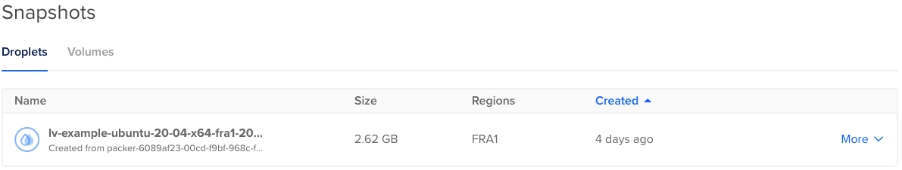

# Stage 2: The different stages to learning how to deploy a Laravel App

## Intro

With this stage we'll stop setting up the infrastructure manually. We'll also move to creating server 
images for faster setup. For this we'll be using [Packer](https://www.packer.io/) and [Terraform](https://www.terraform.io/).

We'll also start making the system more robust so that it can hand a single server falling over.

### Pros

* Very repeatable
* Faster from nothing to fully setup
* Can simply replicate the full infrastructure for dev or testing.
* Everything documented.

### Cons
* Far more complicated.
* Takes longer initially to set up.
* Require knowledge for far more application and moving pieces.
* Setting up a local dev still not covered and hard to keep in sync.

## Assumptions

1. Php code is in git.
1. You are using PostgreSQL.
1. If not, replace the PostgreSQL step with your DB of choice.
1. You have a server.
1. In this example and future ones, we'll be deploying to [DigitalOcean](https://m.do.co/c/179a47e69ec8)
   but the steps should mostly work with any servers.
1. The server is running Ubuntu 20.04
1. You have SSH key pair.
1. Needed to log into your server securely.
1. You have a Domain Name, and you can add entries to point to the server.
1. We'll be using example.com here. Just replace that with your domain of choice.
1. For DNS, I'll be using [Cloudflare](https://www.cloudflare.com/) in these examples.
1. I would recommend using a DNS provider that supports [Terraform](https://www.terraform.io/) and
   [LetsEncrypt](https://community.letsencrypt.org/t/dns-providers-who-easily-integrate-with-lets-encrypt-dns-validation/86438)

## Steps 1: Get tokens

To be able to automat the infrastructure we'll need to get some api keys for the providers we are using.

In our case this is for [Cloudflare](https://www.cloudflare.com/) and Digital ocean.

Let grab those now.

### Getting your Cloudflare api keys

To simplify things we aren't going to fully create the DNS zone as you should have one from the 
previous steps.

Though we are going to generate a token that can, so we have it for future stages.

You may want to lock down the token more than we are doing in the example.

Log into your Cloudflare account. 

On the top right click on user icon and then click on ```My Profile```.


On the next page select the 'Api Tokens' menu option.


Select the ```Edit zone DNS``` ```Use Template``` button.


Now select the ```Create Token``` button.


Give your token a name. (Please do this will help quiet a bit once you have more than one token)

For permissions add the following.
* Zone->Zone Settings->Edit
* Zone->Zone->Edit
* Zone->DNS->Edit

For zone restrictions I've set it to all zones though you may want to lock this down to your specific 
account or zone.

I've left IP Address filtering blank, but it's also good idea to do this if you can.

Once done click ```Continue to Summary```


Now copy the token from the next page. 

Save this somewhere safe as you won't be able to get it again.

I recommend using a shared team password manage. I'm currently using [https://1password.com/](https://1password.com/), 
some friends are using [https://lastpass.com/](https://lastpass.com/), but any will work.

I also recommend creating a bash function to set it as an environmental variable.

This makes it simpler to switch between accounts. Also means you aren't tempted to save it any of your code.

While we are at it will also add one for TF_VAR_cf_api_key which will be needed for Terraform.

Here is an example of how to do this. Just add the following to your .bashrc or .zshrc.

```shell
setCFLvDepProfile() {	
  export CLOUDFLARE_API_TOKEN="MY_TOKEN"
  export TF_VAR_cf_api_key="${CLOUDFLARE_API_TOKEN}"
}
```

### Getting your DigitalOcean api key

Log onto your Digital ocean account.

Then click the ```Api``` menu near the bottom on the left.


Then make sure you are one the ```Tokens/Keys``` tab and click the ```Generate New Token``` button.


This should bring up a box where you can give the token a name.

Leave the 'Write' checkbox ticked.


Once again save this token somewhere save.

I would also once again create a bash function to set it.

While we are at it will also add one for TF_VAR_do_token which will be needed for Terraform.

Here is an example.

```shell
setDOLvDepProfile() {	
  export DIGITALOCEAN_TOKEN="MY_DO_TOKEN"
  export TF_VAR_do_token="${DIGITALOCEAN_TOKEN}"
}
```

To make our lives easier so we don't have ro run both scripts every time.

I would also create a script that set both enviromental variables at the same time.

Here is an example.

```shell
setLvDepProfile() {
  setCFLvDepProfile
  setDOLvDepProfile
}
```

## Steps 2: Build base image

Ok now that we have our tokens we are going to first create a server image.

This makes it quicker and simpler to start more servers as you don't have to do any installs etc
to start them up.

For this we are going to user [Packer](https://www.packer.io/) and the ansible scripts with some small
changes.

All the scipts for this stage can be found here [./infra](./infra).

The Ansible scripts are specifically here. [./infra/ansible](./infra/ansible).

We are going to basically make two changes. 

The first is we are going to remove the PostgreSQL setup from ansible, as we are going to use DigitalOceans db as service.

The second is we are going to use the dns validation, and the Cloudflare api to generate certificates.

This way we don't have the server accessible to generate the certificates.

To do this we are going to create a file to store the Cloudflare key that we'll read in from the
environmental variable ```CLOUDFLARE_API_TOKEN```.

Looking at the deployment task it now contains.

```shell
- name: Creating a file with content
  ansible.builtin.copy:
    dest: "~/.secrets/certbot/cloudflare.ini"
    content: |
      # Cloudflare API token used by Certbot
      dns_cloudflare_api_token = {{ lookup('env', 'CLOUDFLARE_API_TOKEN') }}

- name: Create letsencrypt certificate
  shell: certbot certonly -n --dns-cloudflare --dns-cloudflare-credentials ~/.secrets/certbot/cloudflare.ini -m {{ letsencrypt_email }} --agree-tos -d {{ domain_name }} -d www.{{ domain_name }}
  args:
    creates: /etc/letsencrypt/live/{{ domain_name }}
```

Now set up your packer config.

I'm not going to go too much into this as it's reasonably simple.

Essentially what packer is doing is spinning up a virtual server on your chosen cloud provider.

It will then run the specified scripts agains this sever, in our case we'll be using our modified Ansible
scripts.

Once it's done it will then save the resulting image to the provider and return the unique reference for the server.

We'll just then copy this to our terraform scripts.

You can find the full packer file [here](./infra/packer/packer-ubuntu2004-do.pkr.hcl).

If you open it you'll see the following at the top.

```hcl
variable "do_api_token" {
  type = string
  default = "${env("DIGITALOCEAN_TOKEN")}"
  sensitive = true
}

variable "cf_api_token" {
  type = string
  default = "${env("CLOUDFLARE_API_TOKEN")}"
  sensitive = true
}
```

This is basically where we will be reading the required environmental variables in for Cloudflare and
Digital ocean.

Next we specify some variable for image size to use, location and the base image.

This is done to make it simpler to update the scripts in the future.

```hcl
variable "image_name" {
  type = string
  default = "ubuntu-20-04-x64"
}

variable "region_name" {
  type = string
  default = "fra1"
}

variable "size" {
  type = string
  default = "s-1vcpu-1gb"
}
```

We then specify the settings for the image.

```hcl
source "digitalocean" "autogenerated_1" {
  api_token = "${var.do_api_token}"
  image = "${var.image_name}"
  region = "${var.region_name}"
  size = "${var.size}"
  snapshot_name = "lv-example-${var.image_name}-${var.region_name}-${local.timestamp}"
  ssh_username = "root"
}
```

Finaly we go into the build steps which specify how we want the image to be setup.

The most important being the ansible one.

```hcl
provisioner "ansible" {
  use_proxy               =  false
  roles_path = "../ansible/roles"
  playbook_file = "../ansible/boostrap.yml"
  ansible_env_vars = [
    "CLOUDFLARE_API_TOKEN=${var.cf_api_token}"]
  extra_arguments = [
    "-e",
    "'ansible_python_interpreter=/usr/bin/python3'"]
}
```

If you are making changes to the Ansible scripts I would recommend first just manually spinning up a
server and then running the playbook by hand till everything is working correctly.

If you do it via packer it has to spin up a clean server everytime, and it takes a really long time to
debug.

So let go over how to run packer to create our image.

First make sure you've set your environmental variables for DigitalOcean and Cloudflare.

We then just basically run packer passing it the config file.

```shell
setLvDepProfile
packer build packer-ubuntu2004-do.pkr.hcl
```

Once this has completed running it should print out the name of the new image file.

Looking at the packer config you will see this line.

```hcl
snapshot_name = "lv-example-${var.image_name}-${var.region_name}-${local.timestamp}"
```

So the image file name should look something like ```lv-example-ubuntu-20-04-x64-fra1-20210428185323```.

If you got to the ```Image``` section of digital ocean you should also see the image sitting there.



If you do end up building these images often plase remember to come and clean this up. As you are charged
a small amount for the storage.

## Steps 2: Terraform

Terraform itself is reasonably simple to use. 

You describe and name the item you want it to create.

You can then use this name to refer to generated values to help you set up future items.

As an example you describe the server you would like to create. You can then use the named server object 
to create dns names for its IP's.

Also you can split your Terraform config into different logical blocks by just creating a new file,
and moving the config section over.

Terraform will read in all files in the same directory ending with ```*.tf``` and then work out
which order to run them setup in.

Let's go over the setting up a simple system similar to what we have been doing.

I'll be spinning up the database and redis using DigitalOceans database as a service more to show you how
to create different pieces. You may want to run your own.

### Variables
For commonly changed setting we'll be creating variables. This make it easier to change these in a single 
place rather than hunt through all the files to work out where to change them.

Some variables have default values, and some don't.

The general rule I follow is never have default values for things you never want to be public.

For anything else always put a default value in.

If you then set an environmental variable following the pattern ```TF_VAR_variable_name```.

This will also overwrite default values.

If you look at the bash scripts above they do this for both the DigitalOcean and CloudFlare api tokens.

### DigitalOcean auth

To start we need add the settings that allows Terraform to authenticate against digital ocean.

First we create the variable for the token.

```hcl
variable "do_token" {}
```

Then we tell Terraform to authenticate against digital ocean using that variable.

```hcl
provider "digitalocean" {
  token = var.do_token
}
```

### DigitalOcean server
In this example we are going to assume you don't have a SSH key setup in DigitalOcean.

So first we want to add and register your public key. 

```hcl
resource "digitalocean_ssh_key" "tim-ssh" {
  name = "Tim SSH Key"
  public_key = file("./ssh_key/id_ed25519_macbook.pub")
}
```

Next we want to get the ID for the image we created previously.

We do this by doing a data lookup against DigitalOcean. Giving it the name of the image as they unique
key to do the look up with.

```hcl
data "digitalocean_image" "snapshot" {
  name = var.base_web_snapshot_name
}
```

Next we want to set up some variables.

The size of server we would like to spin up. (https://developers.digitalocean.com/documentation/v2/#sizes)

```hcl
variable server_size {
  default = "s-1vcpu-1gb"
}
```

The region we would like to spin it up in. (https://developers.digitalocean.com/documentation/v2/#regions)

```hcl
variable region {
  default = "fra1"
}
```

We also set up a variable for the quantity of servers we would like to spin up.

```hcl
variable "server_count" {
  description = "Amount of servers"
  default = 2
}
```

With those set we can then do the config to spin up the server. 

You'll see that we specify a format to use the count number to make sure the names are unique.

```hcl
resource "digitalocean_droplet" "web" {
  name = "srv${format("%02d", count.index)}.${var.dns_domain}"
  size = var.server_size
  image = data.digitalocean_image.snapshot.id
  region = var.region
  ipv6 = true
  ssh_keys = [
    digitalocean_ssh_key.tim-ssh.id
  ]
  count = var.server_count
}
```

That's all you need to spin up a server.

###Database

I'm not going to go to much into the database config as it's very simpler to the server above.

```hcl
resource "digitalocean_database_cluster" "postgres-cluster" {
  name = var.db_pg_cluster_name
  engine = "pg"
  version = "13"
  size = var.db_size
  region = var.region
  node_count = var.db_pg_node_count
}

resource "digitalocean_database_db" "database-example" {
  cluster_id = digitalocean_database_cluster.postgres-cluster.id
  name = var.db_pg_name
}
```

Though we do add a firewall for the database allowing only the two servers we created to talk to it.

As we have multiple servers this is a bit more complicated and we need to use the ```for_each``` that 
Terraform provides.

Normally the rule would follow this format.

```hcl
rule {
  type  = "ip_addr"
  value = "192.168.1.1"
}
```

So to loop through the servers and create that we need to do the following.

```hcl
dynamic "rule" {
  for_each = digitalocean_droplet.web
  content {
    type = "droplet"
    value = rule.value["id"]
  }
}
```

So the full rule config becomes.

```hcl
resource "digitalocean_database_firewall" "block-external-fw" {
  cluster_id = digitalocean_database_cluster.postgres-cluster.id

  dynamic "rule" {
    for_each = digitalocean_droplet.web
    content {
      type = "droplet"
      value = rule.value["id"]
    }
  }
}
```

### Redis

The redis config is almost identical to the database one and is bellow.

```hcl
resource "digitalocean_database_cluster" "redis-cluster" {
  name       = var.db_redis_cluster_name
  engine     = "redis"
  version    = "6"
  size       = var.db_size
  region     = var.region
  node_count = var.db_redis_node_count
}

resource "digitalocean_database_firewall" "block-external-fw-redis-pg" {
  cluster_id = digitalocean_database_cluster.redis-cluster.id

  dynamic "rule" {
    for_each = digitalocean_droplet.web
    content {
      type = "droplet"
      value = rule.value["id"]
    }
  }
}
```

### DNS

Ok we are almost done with the Terraform config. We just now need to add the DNS entries so that we
know how to talk to servers.

As with DigitalOcean we need to first authenticate against Cloud flare.

```hcl
provider "cloudflare" {
  api_token = var.cf_api_key
}
```

In this example we're going to assume that you have already set up your DNS on CloudFlare.

So we first need to do the data lookup to get its information.

```hcl
data "cloudflare_zones" "dns-domain" {
  filter {
    name = var.dns_domain
  }
}
```

Next I like just creating a test entry to make sure that everything is working. This more needed
while setting all the pieces up.

```hcl
resource "cloudflare_record" "A-test-dns-domain" {
  zone_id = lookup(data.cloudflare_zones.dns-domain.zones[0], "id")
  name = "test"
  type = "A"
  ttl = var.dns_ttl
  proxied = "false"
  value = "127.0.0.1"
}
```

Now I want to add entries for each individual server, so we can get to each separately.

This will be needed to do updates for you code for now. (We'll automate this in the future).

Here we use the count again but use the amount of servers that are spun up to get that count.

We then also use the index to get the specific information for each server.

We use the count to generate a unique name.

```hcl
resource "cloudflare_record" "A-srv00" {
  zone_id = lookup(data.cloudflare_zones.dns-domain.zones[0], "id")
  name = "srv${format("%02d", count.index)}.${var.dns_domain}"
  type = "A"
  ttl = var.dns_ttl
  value  = element(digitalocean_droplet.web.*.ipv4_address, count.index)
  count  = length(digitalocean_droplet.web.*.ipv4_address)
}
```

Finally, we add both servers to the dns entries for the naked domain and ```www``` e.g.

* example.com
* www.example.com

We also set these to proxied. That way if one goes down CloudFlare should detect it and send all the
traffic to the one that is still up.

Basically giving us high availability for the servers and some load balancing when they are both up.


```hcl
resource "cloudflare_record" "A" {
  zone_id = lookup(data.cloudflare_zones.dns-domain.zones[0], "id")
  name = "@"
  type = "A"
//  ttl = var.dns_ttl
  proxied = true
  count  = length(digitalocean_droplet.web.*.ipv4_address)
  value  = element(digitalocean_droplet.web.*.ipv4_address, count.index)
}

resource "cloudflare_record" "A-www" {
  zone_id = lookup(data.cloudflare_zones.dns-domain.zones[0], "id")
  name = "www"
  type = "A"
//  ttl = var.dns_ttl
  proxied = true
  count  = length(digitalocean_droplet.web.*.ipv4_address)
  value  = element(digitalocean_droplet.web.*.ipv4_address, count.index)
}
```

That's pretty much it for the Terraform side.


