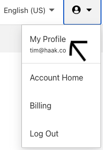
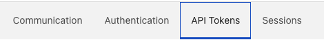
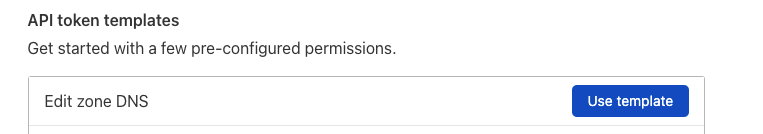
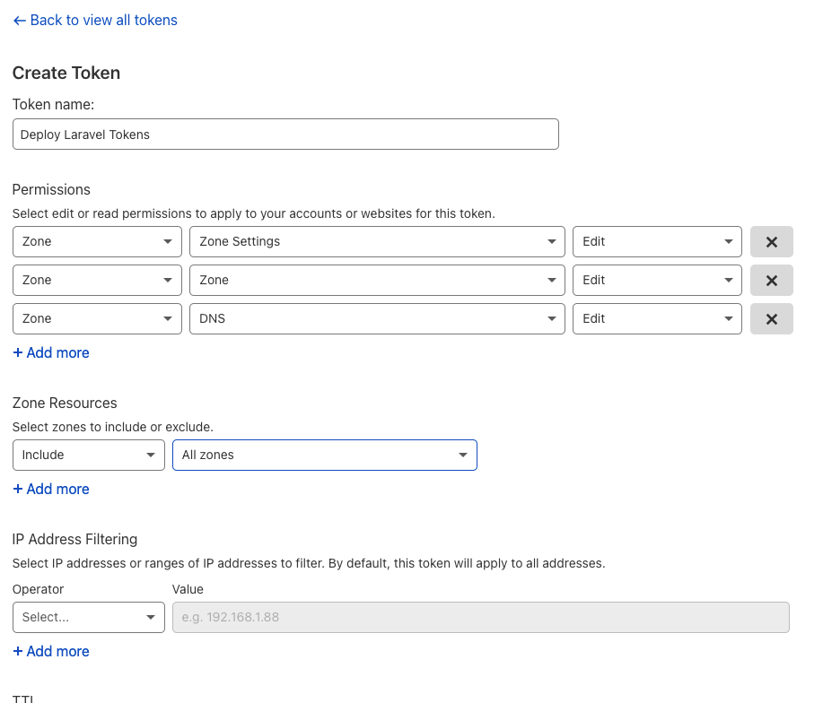
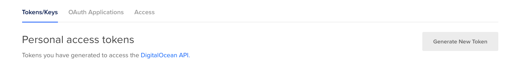
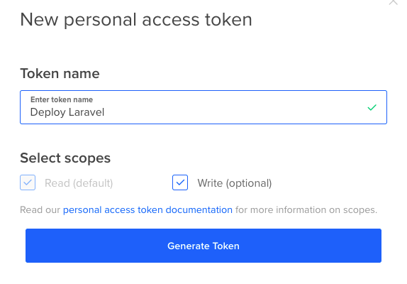

# Stage 2: The different stages to learning how to deploy a Laravel App

## Intro

With this stage we'll stop setting up the infrastructure manually. We'll also move to creating server 
images for faster setup. For this we'll be using [Packer](https://www.packer.io/) and [Terraform](https://www.terraform.io/).

We'll also start making the system more robust so that it can hand a single server falling over.

### Pros

* Very repeatable
* Faster from nothing to fully setup
* Can simply replicate the full infrastructure for dev or testing.
* Everything documented.

### Cons
* Far more complicated.
* Takes longer initially to set up.
* Require knowledge for far more application and moving pieces.
* Setting up a local dev still not covered and hard to keep in sync.

## Assumptions

1. Php code is in git.
1. You are using PostgreSQL.
1. If not, replace the PostgreSQL step with your DB of choice.
1. You have a server.
1. In this example and future ones, we'll be deploying to [DigitalOcean](https://m.do.co/c/179a47e69ec8)
   but the steps should mostly work with any servers.
1. The server is running Ubuntu 20.04
1. You have SSH key pair.
1. Needed to log into your server securely.
1. You have a Domain Name, and you can add entries to point to the server.
1. We'll be using example.com here. Just replace that with your domain of choice.
1. For DNS, I'll be using [Cloudflare](https://www.cloudflare.com/) in these examples.
1. I would recommend using a DNS provider that supports [Terraform](https://www.terraform.io/) and
   [LetsEncrypt](https://community.letsencrypt.org/t/dns-providers-who-easily-integrate-with-lets-encrypt-dns-validation/86438)

## Steps 1: Get tokens

To be able to automat the infrastructure we'll need to get some api keys for the providers we are using.

In our case this is for [Cloudflare](https://www.cloudflare.com/) and Digital ocean.

Let grab those now.

### Getting your Cloudflare api keys

To simplify things we aren't going to fully create the DNS zone as you should have one from the 
previous steps.

Though we are going to generate a token that can, so we have it for future stages.

You may want to lock down the token more than we are doing in the example.

Log into your Cloudflare account. 

On the top right click on user icon and then click on ```My Profile```.



On the next page select the 'Api Tokens' menu option.



Select the ```Edit zone DNS``` ```Use Template``` button.



Now select the ```Create Token``` button.


Give your token a name. (Please do this will help quiet a bit once you have more than one token)

For permissions add the following.
* Zone->Zone Settings->Edit
* Zone->Zone->Edit
* Zone->DNS->Edit

For zone restrictions I've set it to all zones though you may want to lock this down to your specific 
account or zone.

I've left IP Address filtering blank, but it's also good idea to do this if you can.

Once done click ```Continue to Summary```




Now copy the token from the next page. 

Save this somewhere safe as you won't be able to get it again.

I recommend using a shared team password manage. I'm currently using [https://1password.com/](https://1password.com/), 
some friends are using [https://lastpass.com/](https://lastpass.com/), but any will work.

I also recommend creating a bash function to set it as an environmental variable.

This makes it simpler to switch between accounts. Also means you aren't tempted to save it any of your code.

While we are at it will also add one for TF_VAR_cf_api_key which will be needed for Terraform.

Here is an example of how to do this. Just add the following to your .bashrc or .zshrc.

```shell
setCFLvDepProfile() {	
  export CLOUDFLARE_API_TOKEN="MY_TOKEN"
  export TF_VAR_cf_api_key="${CLOUDFLARE_API_TOKEN}"
}
```

### Getting your DigitalOcean api key

Log onto your Digital ocean account.

Then click the ```Api``` menu near the bottom on the left.


Then make sure you are one the ```Tokens/Keys``` tab and click the ```Generate New Token``` button.



This should bring up a box where you can give the token a name.

Leave the 'Write' checkbox ticked.



Once again save this token somewhere save.

I would also once again create a bash function to set it.

While we are at it will also add one for TF_VAR_do_token which will be needed for Terraform.

Here is an example.

```shell
setDOLvDepProfile() {	
  export DIGITALOCEAN_TOKEN="MY_DO_TOKEN"
  export TF_VAR_do_token="${DIGITALOCEAN_TOKEN}"
}
```

To make our lives easier so we don't have ro run both scripts every time.

I would also create a script that set both enviromental variables at the same time.

Here is an example.

```shell
setLvDepProfile() {
  setCFLvDepProfile
  setDOLvDepProfile
}
```

## Steps 2: Build base image

Ok now that we have our tokens we are going to first create a server image.

This makes it quicker and simpler to start more servers as you don't have to do any installs etc
to start them up.

For this we are going to user [Packer](https://www.packer.io/) and the ansible scripts with some small
changes.

All the scipts for this stage can be found here [./infra](./infra).

The Ansible scripts are specifically here. [./infra/ansible](./infra/ansible).

We are going to basically make two changes. 

The first is we are going to remove the PostgreSQL setup from ansible, as we are going to use DigitalOceans db as service.

The second is we are going to use the dns validation, and the Cloudflare api to generate certificates.

This way we don't have the server accessible to generate the certificates.

To do this we are going to create a file to store the Cloudflare key that we'll read in from the
environmental variable ```CLOUDFLARE_API_TOKEN```.

Looking at the deployment task it now contains.

```shell
- name: Creating a file with content
  ansible.builtin.copy:
    dest: "~/.secrets/certbot/cloudflare.ini"
    content: |
      # Cloudflare API token used by Certbot
      dns_cloudflare_api_token = {{ lookup('env', 'CLOUDFLARE_API_TOKEN') }}

- name: Create letsencrypt certificate
  shell: certbot certonly -n --dns-cloudflare --dns-cloudflare-credentials ~/.secrets/certbot/cloudflare.ini -m {{ letsencrypt_email }} --agree-tos -d {{ domain_name }} -d www.{{ domain_name }}
  args:
    creates: /etc/letsencrypt/live/{{ domain_name }}
```

Now set up your packer config.

I'm not going to go too much into this as it's reasonably simple.

Essentially what packer is doing is spinning up a virtual server on your chosen cloud provider.

It will then run the specified scripts agains this sever, in our case we'll be using our modified Ansible
scripts.

Once it's done it will then save the resulting image to the provider and return the unique reference for the server.

We'll just then copy this to our terraform scripts.

You can find the full packer file [here](./infra/packer/packer-ubuntu2004-do.pkr.hcl).

If you open it you'll see the following at the top.

```hcl
variable "do_api_token" {
  type = string
  default = "${env("DIGITALOCEAN_TOKEN")}"
  sensitive = true
}

variable "cf_api_token" {
  type = string
  default = "${env("CLOUDFLARE_API_TOKEN")}"
  sensitive = true
}
```

This is basically where we will be reading the required environmental variables in for Cloudflare and
Digital ocean.

Next we specify some variable for image size to use, location and the base image.

This is done to make it simpler to update the scripts in the future.

```hcl
variable "image_name" {
  type = string
  default = "ubuntu-20-04-x64"
}

variable "region_name" {
  type = string
  default = "fra1"
}

variable "size" {
  type = string
  default = "s-1vcpu-1gb"
}
```

We then specify the settings for the image.

```hcl
source "digitalocean" "autogenerated_1" {
  api_token = "${var.do_api_token}"
  image = "${var.image_name}"
  region = "${var.region_name}"
  size = "${var.size}"
  snapshot_name = "lv-example-${var.image_name}-${var.region_name}-${local.timestamp}"
  ssh_username = "root"
}
```

Finaly we go into the build steps which specify how we want the image to be setup.

The most important being the ansible one.

```hcl
provisioner "ansible" {
  use_proxy               =  false
  roles_path = "../ansible/roles"
  playbook_file = "../ansible/boostrap.yml"
  ansible_env_vars = [
    "CLOUDFLARE_API_TOKEN=${var.cf_api_token}"]
  extra_arguments = [
    "-e",
    "'ansible_python_interpreter=/usr/bin/python3'"]
}
```

If you are making changes to the ansbile scripts I would recommend first just manually spinning up a
server and then running the playbook by hand to test if it's working.

If you do it via packer it has to spin up a clean server everytime, and it takes a really long time to
debug.

So let go over how to run packer to create our image.

First make sure you've set your environmental variables for DigitalOcean and Cloudflare.

We then just basically run packer passing it the hcl file.

```shell
setLvDepProfile
packer build packer-ubuntu2004-do.pkr.hcl
```


